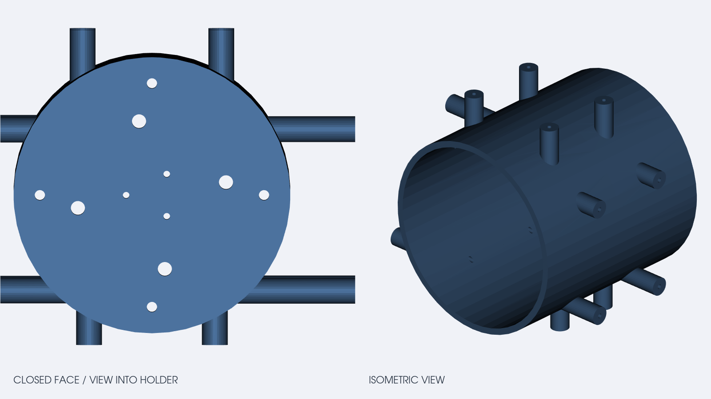

# STM32 / F32C Gimbal Holder v1

这是用于本项目双轴云台、STM32F446RE 控制板和配套驱动板的 3D 安装支架。模型以 STL 二进制格式提供，适合直接导入切片软件进行打印或作为装配参考。

## 文件

- `stm32-f32c-gimbal-holder-v1.stl`：可打印的 STL 网格。
- `stm32-f32c-gimbal-holder-v1-preview.png`：从真实 STL 网格渲染的预览图。左图为从最大中间圆柱支撑架的封口圆面朝开口方向观察的基准视角，右图为等轴视图。

## 装配方向和挂架编号

从最大中间圆柱支撑架的封口面向下（朝开口方向）观察，沿顺时针方向按装配约定编号如下：

| 编号 | 挂架形式 | 设计用途 | 备注 |
| --- | --- | --- | --- |
| 1 | 三孔 | STM32F446RE 挂架 | 安装主控板 |
| 2 | 四孔，最小 | 云台驱动板挂架 | 安装 F32C/云台驱动板 |
| 3 | 四孔，最大 | 特定需求的裁判板挂架 | 可按实际尺寸改为电源模块挂架 |
| 4 | 四孔，中等 | 电源驱动板挂架 | 安装配套电源驱动板 |

编号描述的是封口面视角下的相对顺序；整体旋转模型后，编号随模型一起旋转，不代表 STL 世界坐标中的固定方位。

## 几何信息

- 包围盒尺寸约为 `110 x 90 x 97.9 mm`（X x Y x Z）。
- STL 按毫米理解；导入切片软件后请确认单位未被自动缩放。
- 网格为封闭（watertight）三角网格，可作为打印输入。
- STL 不包含可编辑的 STEP、原生 CAD 或参数化孔位；如需改板卡孔距，建议在此基础上补充可编辑 CAD 源文件。

## 打印和装配建议

以下仅是起始参数，不是已经验证的制造规范：

- PLA 或 PETG；先在目标打印机上确认材料收缩和层间强度。
- 层高可从 `0.20 mm` 开始，外壳 `3-4` 圈，填充率 `25-40%` 作为初始尝试。
- 按切片软件的悬垂和桥接分析决定摆放方向及支撑，不要直接假定预览图方向就是最佳打印方向。
- 打印前用实际板卡、铜柱和紧固件核对孔距、净空、螺钉长度及线缆出口；首次装配建议低速、断电可及。

## 许可

本目录中的机械模型和预览图按 [CC BY 4.0](LICENSE) 发布。再分发或修改时请保留作者和本仓库链接，并在改版文件中注明修改内容。仓库中的固件和 Python 代码使用根目录的 MIT License，两者许可范围不同。
